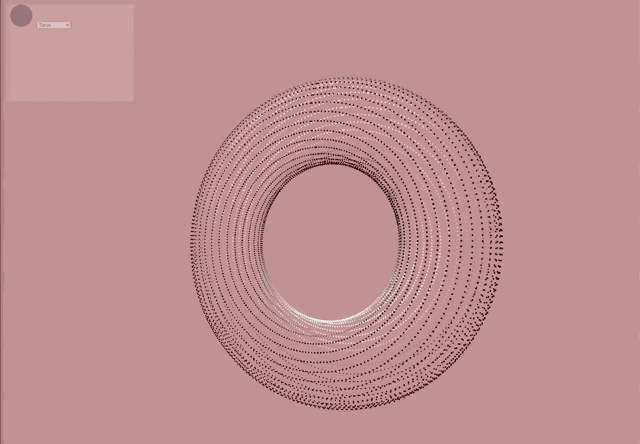
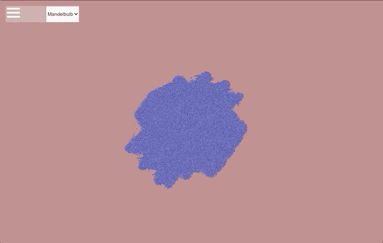
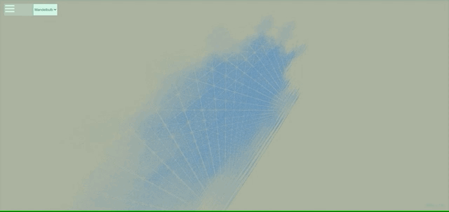
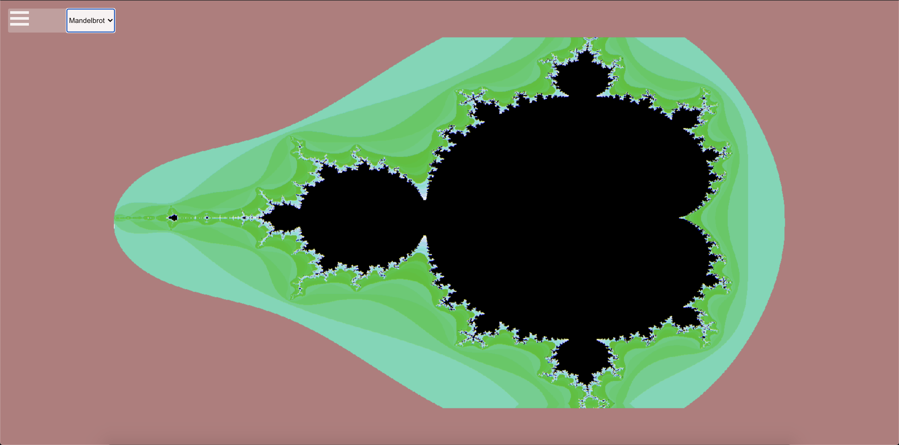
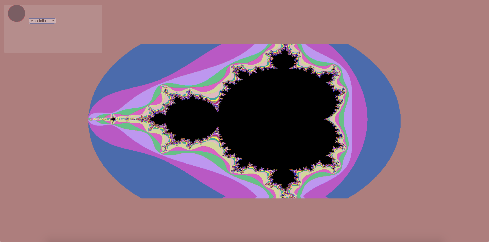

# Welcome to this Math Visualizer

## Tech

- React
- Typescript
- Three.js

Why am I using React here? 

Really just because I want to practice more typescript with React, but also wanted to work on my math chops as I advance more and more into the Cryptographic Math world. But also because I wanted to show that you can use React along with heavy computational math, and visualize it while maintaining performance and integirty.

Im using three.js instead of plain WEBGL because of the readabiity and documentation with Three.js. Its a growing community, and I really like some of the tooling their API has to offer. That being said this is the first time im using it. 

## Setup

Clone the repository

    $cat tsconfig.json // Copy the output
    $rm -rf tsconfig.json
    $yarn start
    // paste old tsconfig.json in the new tsconfig.json

Unfortunately this is the only work around I know with the current CRA- Typescript bug. Currently is an issue with `typscript@4.0.3`

## Torus

TODO Need to post the math used for this, and the references I used

The first completed shape 

## Mandelbulb

Warning! Takes a lot of processing power!

### Insights

My current implementation is niave and was more of a brute force method of plotting out k amount of points in a mandelbulb. My first implementation is pretty simple. We have a 3D Complex Plane. We have a set of complex numbers (triplex) and we represent them with each { x, y } pixel. I then chose a fixed square in the center that I want as my "sphere" or 3D grid, then add a  z value leaving us with { x, y, z }. After applying the Mandelbulb formula on our points 32 times (can increase for more accuracy)we check to see if the number we get back is bounded within our c value in the mandelbulb calculation, and then we have a point within a slice of the mandelbulb. We then decide how may slices we want in our visualization how many z values we will receive. The more slices the more detailed it becomes. 

Now though, we are going to optimize this incredibly. Were going to strip some of the trignomic functions for more algebraic rotation implementations, and then we are also going to try to iterate through the sphere in linear time instead of n^4.

I also need to at an 3D Orbit Trap that will allow for smoothh gradient coloring. 

These two pictures below are examples of me playing around with my mandelbrot naive approach in order to get some sort of mirrored fractal pattern. The first picture shows a little clearer how the slices work. The Second one gives a cool look at the beautiful geometry. It can be tricky getting correct and visible enough slices across the x, and y as well, so in order to get it looking good. 

## Mandelbrot

Need to add coloring to the fractals, and also considering doing a zoom animation as well, but that requires large CPU usage so I dont think it would be appropriate for all hardware so well have to find some time of option for it. 

### Other interests and future goals

- Cayley Diagrams
- Tropical Geometry
- Julia Sets 3D/4D
- Visualize a Cryptographic protocol

## Notes

All memory leaks associated with Three.js are taken care of.. 
