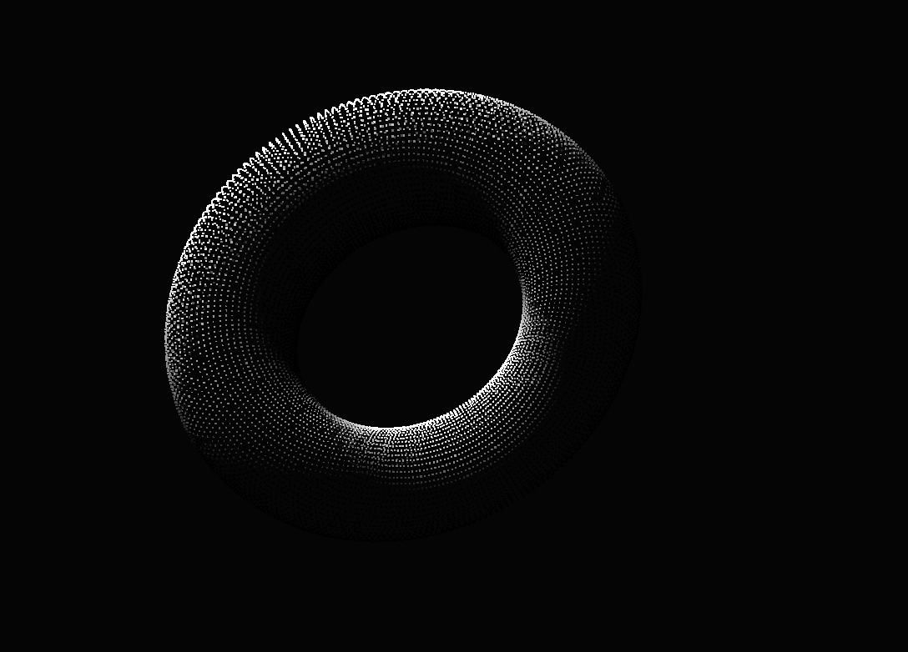
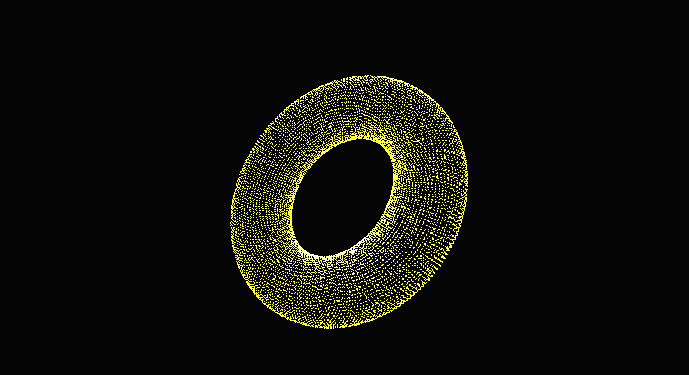

# Welcome to this Math Visualizer

## Tech

- React
- Typescript
- Three.js

Why am I using React here? 

Really just because I want to practice more typescript with React, but also wanted to work on my math chops as I advance more and more into the Cryptographic Math world. But also because I wanted to show that you can use React along with heavy computational math, and visualize it while maintaining performance and integirty.

Im using three.js instead of plan WEBGL because of the readabiity and documentation with Three.js. Its a growing community, and I really like some of the tooling their API has to offer. That being said this is the first time im using it. 

I am almost done with the Torus. I just need to finish working on understanding dynaminc data with a Object3D in Three.js. I have the lighting equation working in conjunction with my torus verticie equation, but I just cant seem to get a custom rotation working, so that I can update my lighting dynamically. 

Here are some pictures so far. Everything is adjustable, to the amount of verticies, to size, speed, and colors. Thats what i need to work on next is the console, and allow it to work in conjunction with the renderer. 

## Setup

Copy `tsconfig.json`

Delete `tsconfig.json`

run `yarn start`

paste old `tsconfig.json`

Unfortunately this is the only work around I know with the current CRA- Typescript bug. Currently is an issue with `typscript@4.0.3`

## Torus

The first completed shape and
