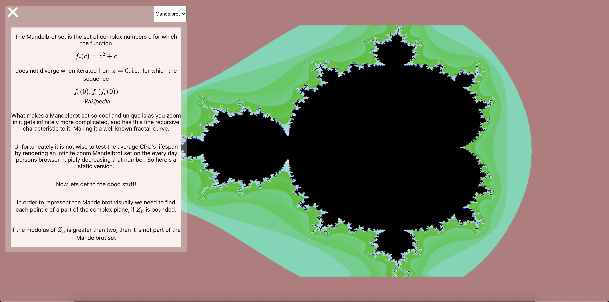

# Welcome to this Math Visualizer

## Tech

- React
- Typescript
- Three.js

Why am I using React here? 

Really just because I want to practice more typescript with React, but also wanted to work on my math chops as I advance more and more into the Cryptographic Math world. But also because I wanted to show that you can use React along with heavy computational math, and visualize it while maintaining performance and integirty.

Im using three.js instead of plain WEBGL because of the readabiity and documentation with Three.js. Its a growing community, and I really like some of the tooling their API has to offer. That being said this is the first time im using it. 

## Setup

Clone the repository

Copy `tsconfig.json`

Delete `tsconfig.json`

run `yarn start`

paste old `tsconfig.json`

Unfortunately this is the only work around I know with the current CRA- Typescript bug. Currently is an issue with `typscript@4.0.3`

## Torus

TODO Need to post the math used for this, and the references I used

The first completed shape 

## Mandelbulb

Currently working on it. 

Stuck on scaling and iterating through the mandelbulb properly

I am having this weird property that is causing each transformation to react to its polar coordinate.

## Mandelbrot

Need to add coloring to the fractals, and also considering doing a zoom animation as well, but that requires large CPU usage so I dont think it would be appropriate for all hardware so well have to find some time of option for it. 

### Other interests and future goals

- Cayley Diagrams
- Tropical Geometry
- Julia Sets 3D/4D
- Visualize a Cryptographic PROTOCOL(WOAHH right???)

## Notes

All memory leaks associated with Three.js is taken care of. The last thing
That needs to get done in regards to the garbage collection is, before switching
visualizations i need to make a promise that will only render the next Object3D if
garbage collection is complete and finished, or else there will be a shader typeerror
that occurs. 
